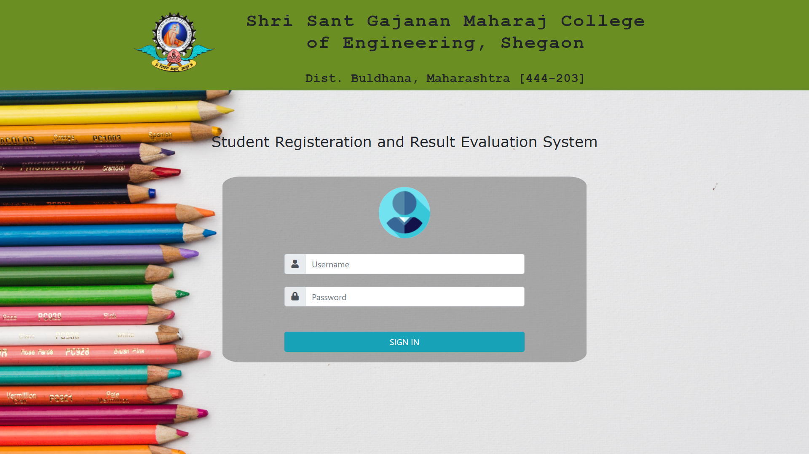
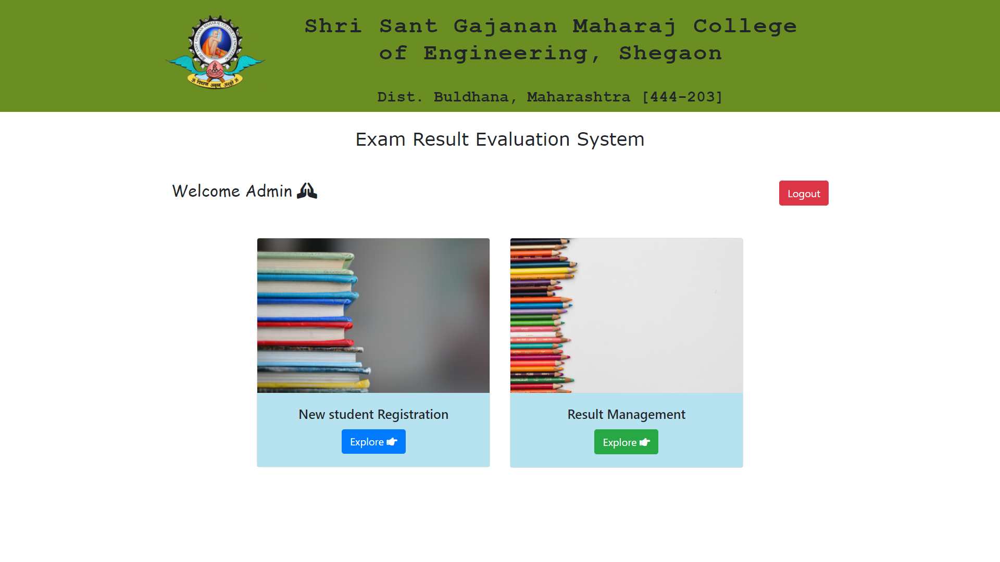
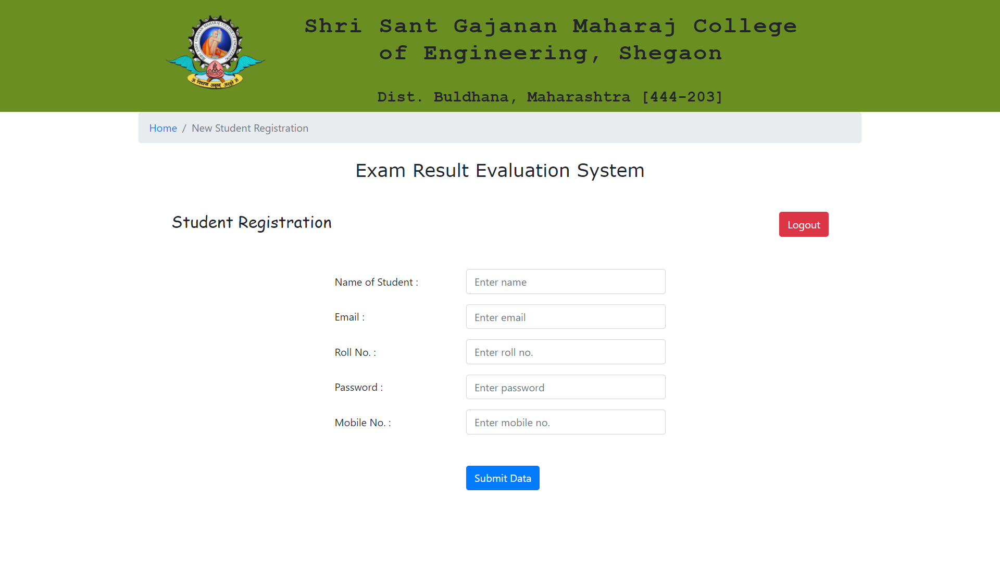
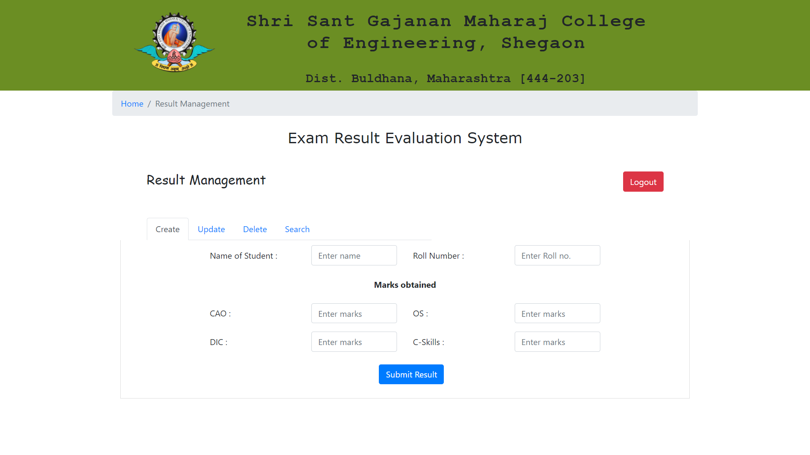
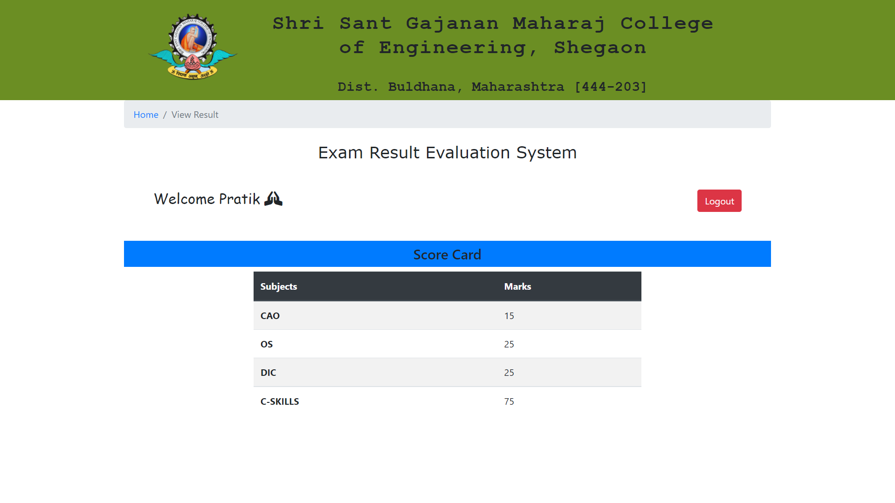

# Student Registration and Result Evaluation System

---

- ### It's a PHP-MySQL project that I've developed, for both teacher and student.

---

- ### Basically, it's a role-based system where the teacher can register a student and manage the result and can do modifications in that.

---

- ### And Students can view the result by logging in to the system with the credentials that the teacher has provided while registering the student.

---

## Screenshots

#### _Login Page_

---

#### _Admin Page_

---

#### _Student Registeration Page_

---

#### _Result Management Page_

---

#### _Student Result Page via Student Login_

